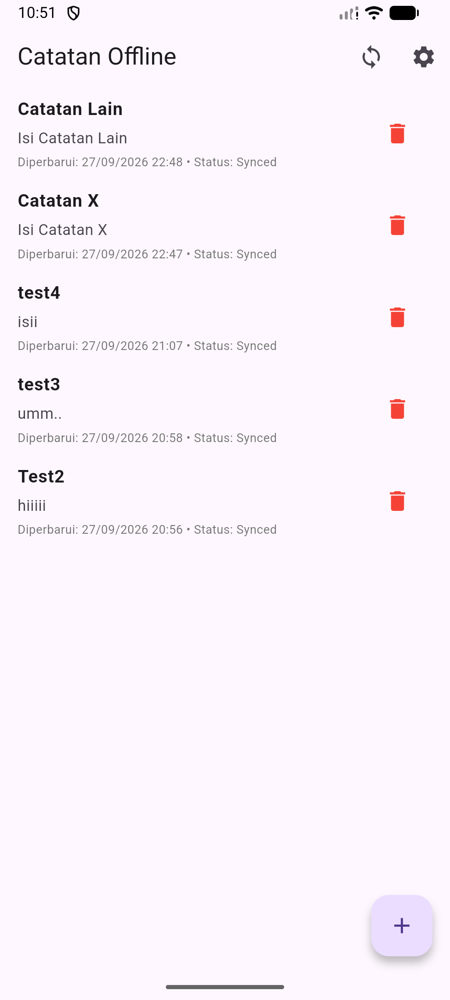
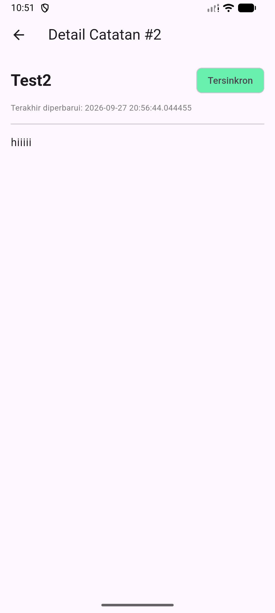
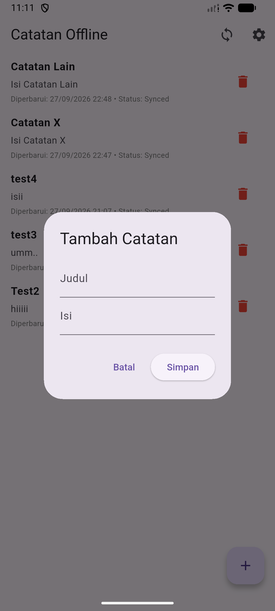
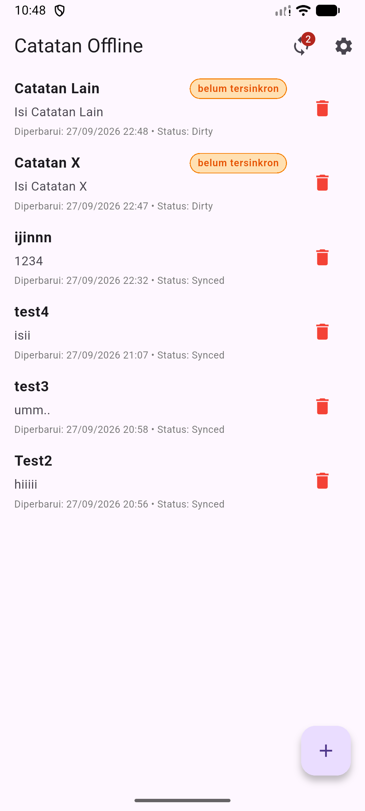
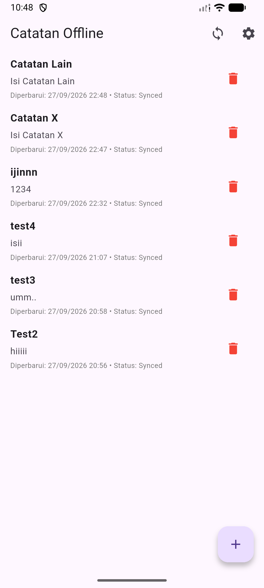
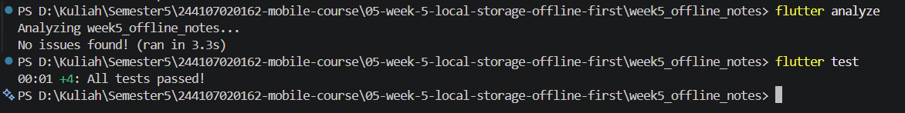

# 05 | Local Storage & Offline First

---
## Tampilan
> 

---
## AI Verification Checklist

- [✓] Apakah AI menempatkan daftar catatan di SharedPreferences? (menolak: rapuh untuk koleksi).
    = Tidak. AI menolak penggunaan SharedPreferences untuk menyimpan daftar catatan dan hanya merekomendasikannya untuk preferensi tema tunggal (dark_mode), karena SharedPreferences sangat rapuh dan lambat untuk data koleksi/terstruktur.
- [✓] Apakah skema AI mendukung antrean sync (dirty flag / updated_at) atau hanya CRUD polos?
    = Ya. Skema AI mendukung antrean sync offline-first dengan menyediakan kolom dirty (penanda status sinkronisasi ke server) dan updated_at (timestamp untuk resolusi konflik Last-Write-Wins).
- [✓] Apakah klaim "real-time" AI didukung stream (Drift/watch) atau hanya asumsi?
    = Ya. Klaim reaktivitas terbukti secara teknis melalui mekanisme Stream terintegrasi (.watch() pada Drift/Hive) serta state invalidation reaktif (ref.invalidate()) pada Riverpod + sqflite.
- [✓] Apakah estimasi boilerplate AI masuk akal setelah Anda mencoba instalasinya (`flutter pub add` + migrasi skema)?
    = Ya. SharedPreferences memiliki boilerplate paling minim, sqflite di tingkat menengah, sedangkan Drift/Hive memiliki boilerplate paling tinggi karena membutuhkan instalasi build_runner dan code generation
- Keputusan final Anda beserta alasannya, boleh berbeda dari rekomendasi AI selama berargumen.
    = Saya lebih memilih SharedPreferences untuk preferensi tema karena ringan dan tidak perlu konfigurasi database, dan sqflite untuk pengelolaan catatan karena memberikan pemahaman query SQL langsung serta bebas dari kompleksitas code untuk praktikum, dan siap diintegrasikan dengan Riverpod.
    
---
## Checklist Verifikasi Mandiri

- [✓] UI tidak memanggil SQLite/SharedPreferences langsung; semua lewat repository + provider.
- [✓] Aplikasi penuh berfungsi dalam mode pesawat: baca, tambah, hapus catatan.
    > 
    > 
- [✓X] Badge dirty akurat sebelum/sesudah sync; cache posts tampil tanpa internet. [cache posts tidak tertampil :( ]
    > 
    > 
- [✓] flutter analyze tanpa issue dan semua test lulus.
    > 
- [✓] Hasil AI diverifikasi dan didokumentasikan pada folder docs/. [docs](/05-week-5-local-storage-offline-first/docs/AI_Challenge.md)

---
## Refleksi

- Mengapa daftar catatan tidak boleh disimpan di SharedPreferences? Apa yang rusak jika aturan ini dilanggar?
    = Karena SharedPreferences menggunakan berkas key-value tunggal (XML/plist) yang dibaca secara utuh ke dalam memori (RAM). Yang trejadi jika dilanggar adalah pembacaan file JSON raksasa akan memicu UI freezing/lag, konsumsi RAM membengkak, serta berisiko data korup.
- Kapan cache-first cukup, dan kapan Anda membutuhkan strategi lain (misalnya network-first untuk data harga real-time)?
    = cache-first cukup saat data yang jarang berubah atau ketika kecepatan respon UI adalah prioritas utama (misal: artikel, profil pengguna, atau catatan pribadi). Dibutuhkannya strategi lain saat digunakan untuk data kritis dan dinamis (misal: harga saham, sisa tiket, atau stok barang). Menampilkan data usang (stale data) pada skenario ini dapat menyebabkan transaksi finansial atau keputusan pengguna yang salah.
- Bagaimana dirty flag berubah menjadi antrean sync tanpa memblokir UI? Kapan antrean terpisah (tabel outbox) menjadi perlu?
    = Dirty flag berubah menjadi antrean sync saat membaca baris WHERE dirty = 1 dan mengunggahnya secara asynchronous di background thread, sehingga UI tetap responsif untuk interaksi pengguna. Tabel Outbox diperlukan saat operasi mutasi bersifat kompleks dan berurutan, membutuhkan pencatatan riwayat retry counter, atau memerlukan penyimpanan payload log terpisah saat urutan eksekusi sync sangat krusial.
- Bagian mana dari rekomendasi AI yang Anda tolak, dan mengapa?
    = Bagian yang saya tolak adalah rekomendasi penggunaan ORM Drift yang mewajibkan code generation. Karena, untuk praktikum/tugas ini, sudah disarankan sejak awal menggunakan sqflite. DI tambah lagi, sqflite jauh lebih efisien karena memberikan kontrol query langsung, waktu kompilasi yang lebih cepat tanpa ketergantungan generator, dan sudah memenuhi seluruh kriteria dirty flag serta pengujian Fake Repository.
---